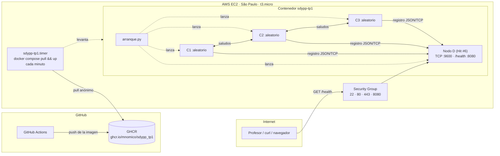
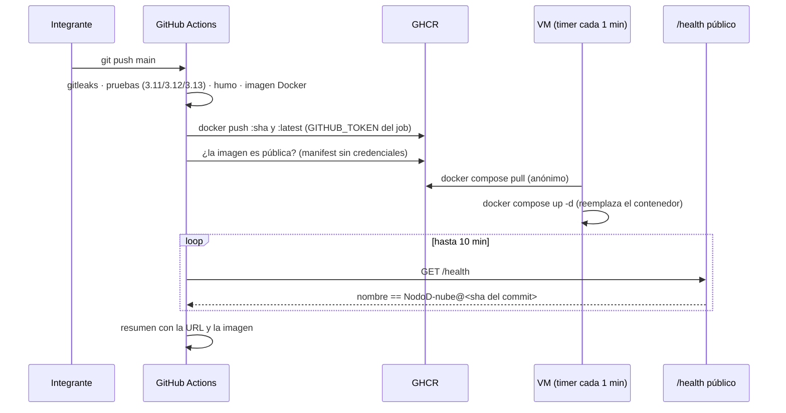

# Despliegue público — VM en AWS EC2

> Consigna transversal del TP: *desplegar el servicio en un entorno público accesible desde
> Internet, con un endpoint público de health-check por servicio que devuelva JSON, y un
> pipeline de CI/CD que compile y despliegue en cada nueva versión.*

**URL pública:** `http://18.231.127.74:8080/health`

## Qué se despliega

Una sola imagen Docker con todo el repositorio ([`Dockerfile`](../Dockerfile)), publicada por el
pipeline en el registro de GitHub como `ghcr.io/mnomico/sdypp_tp1`. Por defecto arranca
[`despliegue/arranque.py`](arranque.py), que levanta **el Nodo D del Hit #6** (registro de
contactos) con su `/health` en el puerto 8080 y **tres nodos C** que se registran contra él
dentro del mismo contenedor. Son exactamente los mismos `python -m hit6.nodo_d` /
`python -m hit6.nodo_c` del README, supervisados por un proceso padre.

La imagen corre en una máquina virtual `t3.micro` de **AWS EC2** (región São Paulo) con
Ubuntu 26.04 y Docker, descrita por [`docker-compose.yml`](docker-compose.yml).



El `/health` responde el estado real del registro: nodos C registrados (con sus puertos
aleatorios), uptime, conexiones atendidas y mensajes inválidos. El nombre del Nodo D lleva el
commit que trae la imagen (`NodoD-nube@<sha>`, horneado con `--build-arg TP1_VERSION`), que es
lo que el pipeline usa para confirmar que la versión nueva ya está sirviendo:

```bash
curl -s http://18.231.127.74:8080/health | python -m json.tool
```

```json
{
  "servicio": "hit6-nodo-d",
  "nombre": "NodoD-nube@b7b3f1a",
  "estado": "ok",
  "uptime_segundos": 5.53,
  "escuchando_en": "0.0.0.0:9600",
  "cantidad_nodos_c_registrados": 3,
  "nodos": [
    {"ip": "127.0.0.1", "puerto": 41103, "nombre": "C1"},
    {"ip": "127.0.0.1", "puerto": 41273, "nombre": "C2"},
    {"ip": "127.0.0.1", "puerto": 39409, "nombre": "C3"}
  ],
  "conexiones_atendidas": 3,
  "mensajes_invalidos": 0
}
```

## Cómo fluye un despliegue



En [`.github/workflows/ci.yml`](../.github/workflows/ci.yml):

1. El job `imagen` construye la imagen con el commit horneado, la levanta, espera a que los
   tres C estén registrados, comprueba que el nombre del Nodo D lleve el SHA y que el proceso
   no corra como root. **Sólo en `push` a `main`**, y sólo si todo eso pasó, la publica en
   GHCR con las etiquetas `:<sha>` y `:latest`.
2. El job `desplegar` (que además necesita gitleaks y la prueba de humo en verde) comprueba
   que la imagen se pueda traer sin credenciales y espera a que el `/health` público responda
   con el SHA del commit recién pusheado. Recién entonces da el despliegue por bueno.
3. La VM no recibe órdenes de nadie: un timer de `systemd` hace `docker compose pull && up -d`
   cada minuto. Si hay una imagen `:latest` nueva, la trae y reemplaza el contenedor; si no,
   no hace nada. Docker apaga el contenedor viejo con `SIGTERM`, que `arranque.py` maneja
   cerrando D y los C con gracia. (decidimos esto para evitar poner ssh en los git secret)
4. Si la IP cambia, cargar la variable de repositorio `TP1_URL` (por ejemplo
   `http://1.2.3.4:8080`) para que el pipeline verifique la URL correcta, y actualizar este
   README y el principal.

## Decisiones de diseño

- **Despliegue por *pull*, sin credenciales en GitHub.** El pipeline no entra a la VM: publica
  la imagen en GHCR con el `GITHUB_TOKEN` efímero que GitHub emite para cada job, y la VM trae
  la imagen por su cuenta. No hay clave SSH ni credenciales de AWS guardadas como secret, y la
  VM tampoco guarda credenciales: el paquete es público y el `pull` es anónimo. Es la variante
  más simple de *zero static keys*.
- **El pipeline sigue siendo la puerta.** Aunque la VM se actualice sola, sólo puede traer lo
  que el pipeline publicó, y el pipeline publica sólo desde `main` y sólo con gitleaks, las
  pruebas, la prueba de humo y la prueba de la imagen en verde. Y el despliegue no se da por
  bueno hasta ver el commit en el `/health` público.
- **Un puerto publicado, el del `/health`.** El puerto TCP de registro (9600) queda interno al
  contenedor y los nodos C corren como procesos hermanos. Para que nodos C de otras máquinas
  se anoten en D alcanza con publicar el 9600 en `docker-compose.yml` y abrirlo en el Security
  Group; se dejó cerrado porque la consigna pide público el health, no el registro.
- **HTTP plano por IP.** La consigna pide un endpoint público que devuelva JSON; HTTPS exigiría
  un dominio y un certificado que no aportan nada al TP.
- **Imagen mínima.** Multi-stage (las dependencias se instalan en una etapa y se copia sólo el
  `venv`), base `python:3.13-slim` versionada, usuario sin privilegios, `HEALTHCHECK`, sin
  secrets en `ENV`, `.dockerignore` que deja afuera `.git`, `.venv`, `logs/` y `.env`. Pesa 63 MB
  comprimida.
- **Estado efímero.** Los logs en disco viven en el sistema de archivos del contenedor y se
  pierden con cada despliegue (Docker rota los del contenedor a 3 × 5 MB para no llenar la VM);
  el registro de contactos está en RAM por consigna.

## Probar la imagen sin nube

```bash
docker build --build-arg TP1_VERSION=$(git rev-parse HEAD) -t sdypp-tp1 .
docker run --rm -p 8080:8080 sdypp-tp1
curl -s http://127.0.0.1:8080/health | python -m json.tool
```

`TP1_DEMO_NODOS_C` cambia la cantidad de nodos C (`-e TP1_DEMO_NODOS_C=5`) y `PORT` el puerto
del `/health`. El job `imagen` del pipeline hace exactamente esto en cada push y PR: construye,
levanta, espera a que los tres C estén registrados y comprueba que el proceso no corra como
root. Y con la imagen ya publicada, `docker compose -f despliegue/docker-compose.yml up -d`
levanta en cualquier máquina lo mismo que corre en la VM.