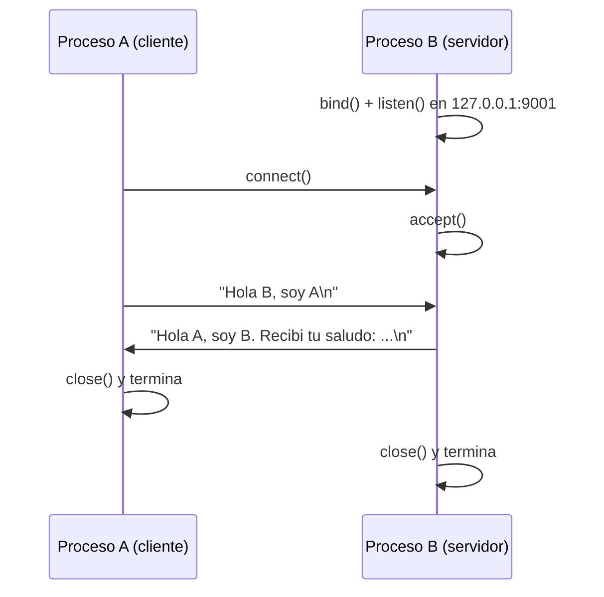

# Hit #1 — Cliente y servidor TCP básicos

> Elaboren un código de servidor TCP para B que espere el saludo de A y lo responda.
> Elaboren un código de cliente TCP para A que se conecte con B y lo salude.

## Arquitectura



| Componente | Archivo | Rol |
|---|---|---|
| Proceso B | `servidor_b.py` | Espera pasivamente y responde el saludo |
| Proceso A | `cliente_a.py` | Toma la iniciativa y saluda |
| Protocolo | [`../comun/protocolo.py`](../comun/protocolo.py) | Delimitación de mensajes sobre el flujo TCP |
| Logs | [`../comun/registro.py`](../comun/registro.py) | Registro en memoria y disco |

## Ejecución

Desde la **raíz del repositorio**, en dos terminales:

```bash
python -m hit1.servidor_b --puerto 9001                          # terminal 1
python -m hit1.cliente_a  --puerto 9001 --saludo "Hola B, soy A" # terminal 2
```

```
INFO [hit1.cliente_a] Respuesta de B: Hola A, soy B. Recibi tu saludo: Hola B, soy A
```

Parámetros: `--host`, `--puerto` y, en el cliente, `--saludo`. Por entorno o `.env`:
`TP1_HOST`, `TP1_PUERTO_HIT1`, `TP1_SALUDO`, `TP1_TIMEOUT` — ver
[`.env.example`](../.env.example). Precedencia: CLI > entorno > default.

## Decisiones de diseño

- **Delimitación por `\n`.** TCP es un flujo de bytes sin noción de mensaje: un `send` no se corresponde con un `recv`. `LectorDeMensajes` acumula en un buffer hasta el delimitador, así un saludo partido en varios segmentos se reensambla y dos que llegan juntos se separan. Es la base sobre la que el Hit #5 monta JSON.
- **Alcance deliberadamente mínimo.** B atiende **una** conexión y termina; no hay reintentos. Son las carencias que resuelven el Hit #2 (A reconecta) y el Hit #3 (B persiste).
- **Lógica separada del `main`.** `atender_una_conexion()` y `saludar()` reciben el socket ya creado, lo que permite probarlas con puerto efímero (`0`) sin levantar procesos.
- **`SO_REUSEADDR`.** Evita "Address already in use" por sockets en `TIME_WAIT` al reiniciar B.
- **UTF-8 explícito**, no el locale del sistema, que varía entre nuestras máquinas y el runner de CI.
- **Si A se va antes de saludar, B termina limpio.** Sale con código 0 y lo deja en el log. Que B termine es el alcance del hit; que termine con traceback se ve como un programa roto.

## Pruebas

```bash
python -m unittest discover -s hit1 -t . -v
```

Construcción de la respuesta (unitaria) e intercambio completo A↔B sobre un socket
real en puerto efímero (integración).
