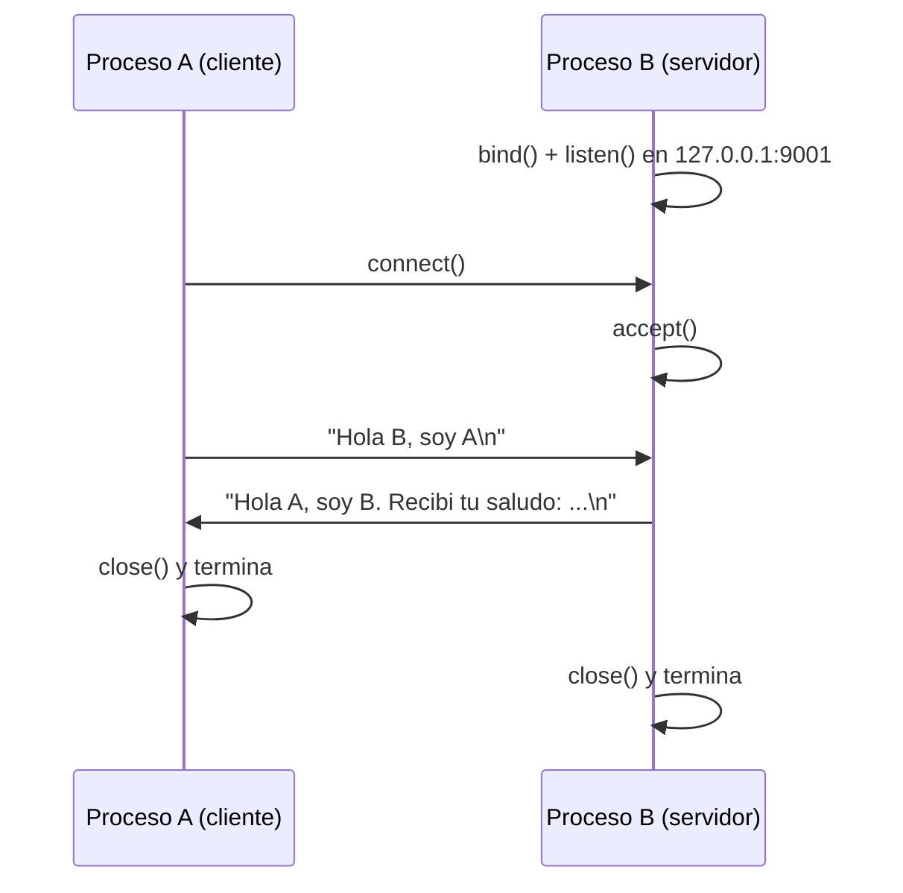

# Hit #1 — Cliente y servidor TCP básicos

> Elaboren un código de servidor TCP para B que espere el saludo de A y lo responda.
> Elaboren un código de cliente TCP para A que se conecte con B y lo salude.

## Arquitectura



| Componente | Archivo | Rol |
|---|---|---|
| Proceso B | `servidor_b.py` | Servidor: espera pasivamente y responde el saludo |
| Proceso A | `cliente_a.py` | Cliente: toma la iniciativa y saluda |
| Protocolo | `../comun/protocolo.py` | Delimitación de mensajes sobre el flujo TCP |
| Logs | `../comun/registro.py` | Registro en memoria y disco |

## Ejecución

Desde la **raíz del repositorio**, en dos terminales:

```bash
# Terminal 1 — primero el servidor
python -m hit1.servidor_b --puerto 9001

# Terminal 2 — después el cliente
python -m hit1.cliente_a --puerto 9001 --saludo "Hola B, soy A"
```

Salida esperada en A:

```
INFO [hit1.cliente_a] Conectando a B en 127.0.0.1:9001
INFO [hit1.cliente_a] Respuesta de B: Hola A, soy B. Recibi tu saludo: Hola B, soy A
```

Parámetros: `--host` (default `127.0.0.1`), `--puerto` (default `9001`) y, en el cliente, `--saludo`.

También se pueden fijar por entorno (`TP1_HOST`, `TP1_PUERTO_HIT1`, `TP1_SALUDO`) o en
un `.env` en la raíz — ver [`.env.example`](../.env.example). Precedencia:
línea de comandos > variable de entorno > default.

## Decisiones de diseño

- **Delimitación de mensajes.** TCP es un flujo de bytes sin noción de mensaje: un `send` no se corresponde con un `recv`. Se delimita cada mensaje con `\n` y `LectorDeMensajes` acumula en un buffer hasta encontrarlo, de modo que un saludo partido en varios segmentos se reensambla y dos saludos que llegan juntos se separan. Es la base sobre la que el Hit #5 monta JSON.
- **Alcance deliberadamente mínimo.** B atiende **una** conexión y termina; no hay reintentos ni tolerancia a fallos. Son exactamente las carencias que resuelven el Hit #2 (A reconecta) y el Hit #3 (B persiste).
- **Lógica separada del `main`.** `atender_una_conexion()` y `saludar()` reciben el socket ya creado, lo que permite probarlas con puerto efímero (`puerto 0`) sin levantar procesos.
- **`SO_REUSEADDR`.** Evita el error "Address already in use" por sockets en `TIME_WAIT` al reiniciar B durante las pruebas.
- **UTF-8 explícito.** El protocolo fija la codificación en vez de depender del locale del sistema operativo, que varía entre las máquinas del equipo y el runner de CI.

## Pruebas

En `tests/`, ejecutables desde la raíz del repositorio:

```bash
python -m unittest discover -s hit1 -t . -v
```

Cubren la construcción de la respuesta (unitaria) y el intercambio completo A↔B sobre un socket real en puerto efímero (integración).
