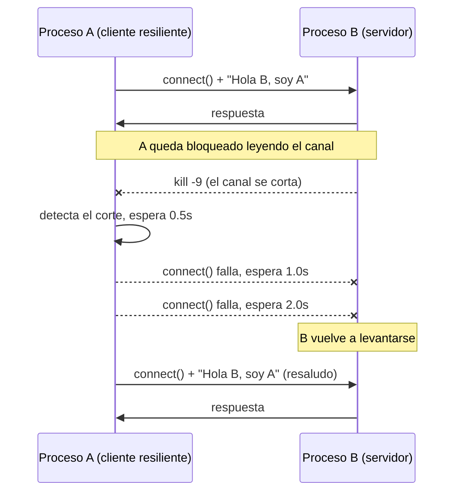

# Hit #2 — Reconexión automática de A

> Revise el código de A para implementar una funcionalidad que permita la reconexión
> y el envío del saludo nuevamente en caso de que el proceso B cierre la conexión,
> como por ejemplo, al ser terminado abruptamente.

## Arquitectura



## Ejecución

Desde la **raíz del repositorio**:

```bash
# Terminal 1
python -m hit2.servidor_b --puerto 9002

# Terminal 2
python -m hit2.cliente_a --puerto 9002
```

Para reproducir la caída de B: matarlo con `kill -9 <pid>` (o `Ctrl+C`) y volver a levantarlo.
A reintenta solo y vuelve a saludar, sin intervención manual.

```
INFO    [hit2.cliente_a] Respuesta de B: Hola A, soy B. Recibi tu saludo: Hola B, soy A
WARNING [hit2.cliente_a] Comunicacion con B interrumpida (el par cerró la conexión). Reintento en 0.5s
WARNING [hit2.cliente_a] Comunicacion con B interrumpida ([Errno 111] Connection refused). Reintento en 1.0s
WARNING [hit2.cliente_a] Comunicacion con B interrumpida ([Errno 111] Connection refused). Reintento en 2.0s
INFO    [hit2.cliente_a] Conectado a B en 127.0.0.1:9002
INFO    [hit2.cliente_a] Saludo enviado: Hola B, soy A
```

Parámetro adicional: `--max-ciclos N` limita la cantidad de intentos (sin él, A reintenta indefinidamente hasta `Ctrl+C`).

Configuración por entorno o `.env`: `TP1_HOST`, `TP1_PUERTO_HIT2`, `TP1_SALUDO`,
`TP1_ESPERA_INICIAL`, `TP1_ESPERA_MAXIMA` — ver [`.env.example`](../.env.example).
Precedencia: línea de comandos > variable de entorno > default.

## Decisiones de diseño

- **Dos fallas distintas, un mismo camino de recuperación.** A puede fallar porque B cierra un canal ya establecido (`ConexionCerrada`) o porque el `connect()` es rechazado (`OSError`/`Connection refused`). Ambas se tratan igual: reintentar. Distinguirlas sería inútil, ya que desde el cliente son indistinguibles en la práctica.
- **Backoff exponencial con tope (0.5s → 1s → 2s → … → 5s).** Reintentar en un bucle cerrado desperdicia CPU y golpea innecesariamente a un servidor que quizás está arrancando. El tope evita que la espera crezca sin límite y deje a A dormido cuando B ya volvió. El contador se reinicia tras cada conexión exitosa.
- **A queda bloqueado leyendo tras saludar.** Es lo que permite *detectar* la caída de B: cuando el socket devuelve `b""` (FIN) o un `RST`, A sabe que perdió al par. Sin esta lectura, A no se enteraría de la desconexión hasta el próximo envío.
- **B mantiene el canal abierto y responde cada saludo.** Es el cambio mínimo respecto del Hit #1 para que la reconexión sea observable: si B cerrara tras responder, A reconectaría en un bucle infinito y no se distinguiría el caso "B murió".
- **B todavía muere cuando A se va.** Es intencional: deja expuesta la carencia que resuelve el Hit #3.
- **`dormir` inyectable.** `ejecutar()` recibe la función de espera por parámetro, así los tests verifican la secuencia de backoff sin dormir de verdad (la suite corre en milisegundos en vez de segundos).

## Pruebas

En `tests/`, ejecutables desde la raíz del repositorio:

```bash
python -m unittest discover -s hit2 -t . -v
```

- Unitarias: progresión del backoff y su tope.
- Integración: B muere y vuelve a levantarse — se verifica que A resaluda en cada reconexión; y B nunca disponible — se verifica que A reintenta con esperas crecientes en vez de abortar.
