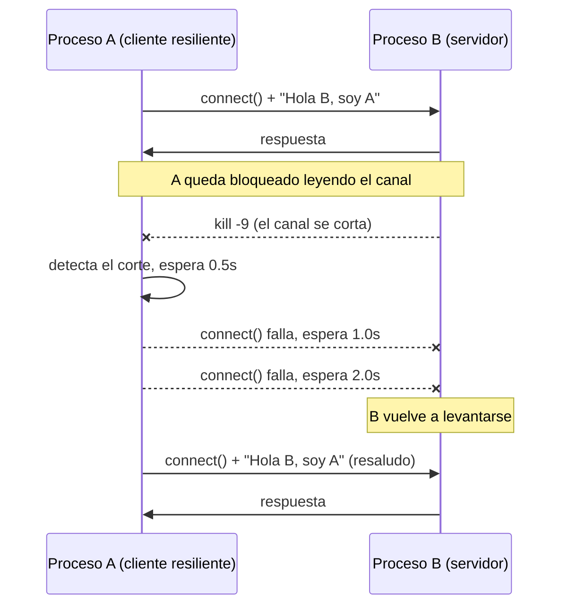

# Hit #2 — Reconexión automática de A

> Revise el código de A para implementar una funcionalidad que permita la reconexión
> y el envío del saludo nuevamente en caso de que el proceso B cierre la conexión,
> como por ejemplo, al ser terminado abruptamente.

## Arquitectura



## Ejecución

```bash
python -m hit2.servidor_b --puerto 9002   # terminal 1
python -m hit2.cliente_a  --puerto 9002   # terminal 2
```

Matar B con `kill -9 <pid>` y volver a levantarlo: A reintenta y resaluda solo.

```
INFO    [hit2.cliente_a] Respuesta de B: Hola A, soy B. Recibi tu saludo: Hola B, soy A
WARNING [hit2.cliente_a] Comunicacion con B interrumpida (el par cerró la conexión). Reintento en 0.5s
WARNING [hit2.cliente_a] Comunicacion con B interrumpida ([Errno 111] Connection refused). Reintento en 1.0s
INFO    [hit2.cliente_a] Conectado a B en 127.0.0.1:9002
```

Parámetros de A: `--host`, `--puerto`, `--saludo`, `--max-ciclos N` (sin él reintenta
indefinidamente) y `--salir-tras-respuesta` (termina apenas B contesta; lo usa la
prueba de humo del CI). B: `--host`, `--puerto`. Por entorno o `.env`: `TP1_HOST`,
`TP1_PUERTO_HIT2`, `TP1_SALUDO`, `TP1_TIMEOUT`, `TP1_ESPERA_INICIAL`,
`TP1_ESPERA_MAXIMA` — ver [`.env.example`](../.env.example).

## Decisiones de diseño

- **Dos fallas, un mismo camino.** B cierra un canal establecido (`ConexionCerrada`) o el `connect()` es rechazado (`OSError`): desde A son indistinguibles en la práctica, así que ambas se tratan reintentando.
- **Backoff exponencial con tope (0.5s → 1s → 2s → … → 5s).** Un bucle cerrado desperdicia CPU y golpea a un servidor que quizás está arrancando; el tope evita que A quede dormido cuando B ya volvió. Se reinicia tras cada conexión exitosa.
- **A queda bloqueado leyendo tras saludar.** Es lo que le permite *detectar* la caída: sin esa lectura no se enteraría hasta el próximo envío.
- **B mantiene el canal abierto** y responde cada saludo; si cerrara tras responder, A reconectaría en bucle y no se distinguiría el caso "B murió".
- **B todavía muere cuando A se va, pero ordenado.** Un `kill -9` sobre A manda un `RST`, que llega como `OSError`, no como fin de flujo. B distingue los dos casos y sale con código 0 en ambos. Antes el `RST` no se atrapaba y B moría con traceback y código 1: la misma limitación (que resuelve el Hit #3), pero indistinguible de un programa roto.
- **Una línea ilegible no corta el canal.** Bytes que no son UTF-8 levantan `MensajeIlegible`; B descarta esa línea y sigue.
- **`dormir` inyectable.** `ejecutar()` recibe la función de espera por parámetro: los tests verifican la secuencia de backoff sin dormir de verdad.

## Pruebas

```bash
python -m unittest discover -s hit2 -t . -v
```

Backoff y su tope (unitarias) · B muere y vuelve: A resaluda · B nunca disponible: A
reintenta en vez de abortar · B vivo y callado: A no reconecta por timeout ·
`--salir-tras-respuesta` · A muere de golpe (`RST` con `SO_LINGER`): B termina sin
excepción · línea ilegible descartada.
