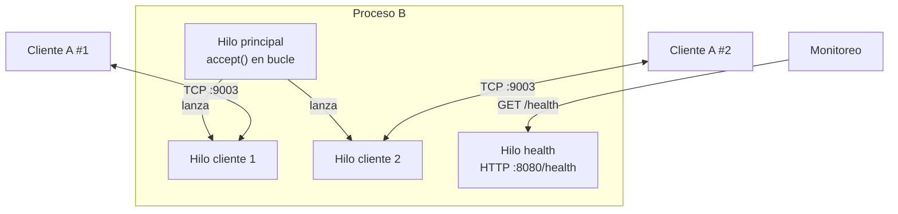

# Hit #3 — Servidor B persistente

> Modifique el código de B para que si el proceso A cierra la conexión
> (por ejemplo matando el proceso) siga funcionando.

## Arquitectura



El hilo principal **sólo acepta** conexiones; cada cliente se atiende en su propio hilo.
Así, un corte abrupto de A afecta únicamente a ese hilo y nunca al bucle de `accept()`.

## Ejecución

Desde la **raíz del repositorio**:

```bash
# Terminal 1
python -m hit3.servidor_b --puerto 9003 --puerto-health 8080

# Terminal 2 (se pueden abrir varios clientes en paralelo)
python -m hit3.cliente_a --puerto 9003
```

Verificación del enunciado — matar A y comprobar que B sigue en pie:

```bash
kill -9 <pid de A>
curl http://127.0.0.1:8080/health
python -m hit3.cliente_a --puerto 9003   # B lo sigue atendiendo
```

Respuesta del health check:

```json
{
  "servicio": "hit3-servidor-b",
  "estado": "ok",
  "uptime_segundos": 9.516,
  "puerto_tcp": 9003,
  "conexiones_activas": 0,
  "conexiones_atendidas": 2,
  "saludos_recibidos": 2
}
```

Parámetros de B: `--host`, `--puerto`, `--puerto-health`, `--sin-health`.

Configuración por entorno o `.env`: `TP1_HOST`, `TP1_PUERTO_HIT3`,
`TP1_PUERTO_HEALTH` — ver [`.env.example`](../.env.example). Precedencia: línea de
comandos > variable de entorno > default. Al desplegar en la nube conviene
`TP1_HOST=0.0.0.0` para aceptar conexiones externas.

## Decisiones de diseño

- **Un hilo por conexión.** Es el modelo más simple que cumple el requisito y el que mejor expone la idea de aislamiento de fallos: la excepción que provoca la muerte de A queda contenida en su hilo. Con la cantidad de clientes de este TP el costo de los hilos es irrelevante; a mayor escala correspondería `selectors`/`asyncio`.
- **Toda excepción del cliente se atrapa y se registra.** `ConexionCerrada` (cierre ordenado), `OSError` (incluye `ConnectionResetError`, el `RST` de un `kill -9`) y `MensajeDemasiadoLargo` se loguean y terminan sólo ese hilo. El `finally` descuenta la conexión activa aunque el fallo sea inesperado, para que las métricas no se desincronicen.
- **El bucle de `accept()` también tolera fallos.** Si `accept()` falla por una causa transitoria, se registra y se sigue escuchando; sólo se corta cuando `detener()` cerró el socket a propósito. Un servidor que muere por un error de un cliente no cumpliría el hit.
- **Estado protegido con un `Lock`.** Los contadores los tocan varios hilos a la vez; sin el lock, los incrementos podrían perderse y el `/health` reportaría números erróneos.
- **Health check sobre HTTP, no sobre el puerto TCP.** El enunciado pide un endpoint público que devuelva JSON: HTTP es lo que entienden los balanceadores y las sondas del proveedor de nube. Corre en un hilo daemon aparte para que un problema del monitoreo no afecte al servicio, y expone `uptime` y contadores además del estado.
- **A no cambia respecto del Hit #2.** Conserva la reconexión, lo que permite ver el efecto combinado: A sobrevive a la caída de B *y* B sobrevive a la caída de A.

## Pruebas

En `tests/`, ejecutables desde la raíz del repositorio:

```bash
python -m unittest discover -s hit3 -t . -v
```

- **Corte abrupto del cliente:** se fuerza un `RST` con `SO_LINGER` en 0 (equivalente a `kill -9` sobre A) y se verifica que B queda en `estado: ok` y sigue atendiendo nuevas conexiones.
- **Conexiones sucesivas y concurrentes:** dos clientes simultáneos intercalan mensajes sin interferirse.
- **Health check:** el JSON refleja las conexiones realmente atendidas.
