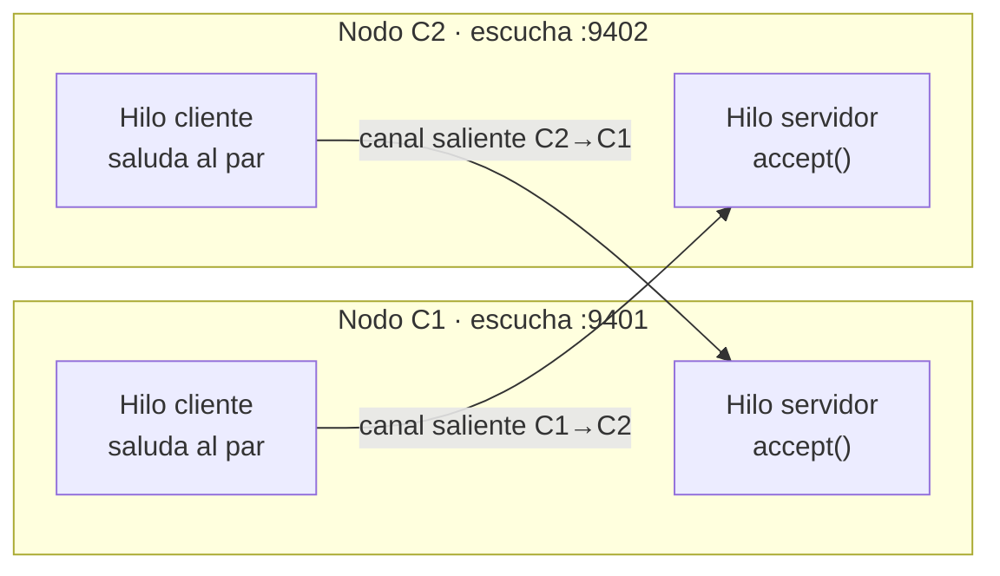

# Hit #4 — Nodo C: cliente y servidor simultáneos

> Refactoriza el código de los programas A y B en un único programa, que funcione
> simultáneamente como cliente y servidor. [...] al tener dos instancias de C en
> ejecución, cada una configurada con los parámetros del otro, ambas se saludan
> mutuamente a través de cada canal de comunicación.

## Arquitectura

Cada nodo C combina las dos mitades de los hits anteriores: el servidor persistente
del Hit #3 y el cliente con reconexión del Hit #2, corriendo a la vez en un mismo
proceso. **Entre dos nodos hay dos conexiones TCP independientes, una por sentido.**



Dentro de un nodo:

| Hilo | Origen | Responsabilidad |
|---|---|---|
| `_aceptar_conexiones` | Hit #3 | Acepta conexiones y lanza un hilo por cliente |
| `_atender` | Hit #3 | Responde saludos; aísla los fallos de cada par |
| `_saludar_al_par` | Hit #2 | Abre el canal saliente, saluda y reconecta con backoff |
| health | Hit #3 | Sirve `GET /health` con el estado de **ambos** lados |

## Ejecución

Dos instancias, cada una apuntando a la otra (el orden de arranque no importa:
la primera reintenta hasta que aparezca la segunda):

```bash
# Terminal 1
python -m hit4.nodo_c --puerto 9401 --par-host 127.0.0.1 --par-puerto 9402 \
                      --nombre C1 --puerto-health 8401

# Terminal 2
python -m hit4.nodo_c --puerto 9402 --par-host 127.0.0.1 --par-puerto 9401 \
                      --nombre C2 --puerto-health 8402
```

En el log de C1 se ven los dos canales por separado:

```
INFO [hit4.nodo_c] C1 escuchando en 127.0.0.1:9401
INFO [hit4.nodo_c] [entrante] saludo de 127.0.0.1:47976: Hola, soy C2
INFO [hit4.nodo_c] [saliente] conectado al par 127.0.0.1:9402
INFO [hit4.nodo_c] [saliente] saludo enviado: Hola, soy C1
INFO [hit4.nodo_c] [saliente] respuesta del par: Hola, soy C2. Recibi tu saludo: Hola, soy C1
```

```bash
curl http://127.0.0.1:8401/health
```

```json
{
  "servicio": "hit4-nodo-c", "nombre": "C1", "estado": "ok",
  "escuchando_en": "127.0.0.1:9401", "par": "127.0.0.1:9402",
  "canal_saliente": "conectado",
  "saludos_recibidos": 1, "saludos_enviados": 1, "respuestas_recibidas": 1
}
```

Parámetros: `--host`, `--puerto`, `--par-host`, `--par-puerto` (obligatorios los dos
últimos), `--nombre`, `--puerto-health`, `--sin-health`, `--duracion`.
Configurables por entorno: `TP1_HOST`, `TP1_PUERTO_HIT4` — ver [`.env.example`](../.env.example).

## Decisiones de diseño

- **Un canal por sentido, no uno compartido.** Cada nodo abre su propia conexión
  saliente en lugar de reutilizar la entrante del par. Así los dos sentidos son
  simétricos e independientes: cada nodo controla cuándo saluda y su reconexión no
  depende de que el otro lo haya contactado primero. Es también lo que necesita el
  Hit #6, donde un nodo saluda a varios pares que nunca lo contactan.
- **Composición en vez de reescritura.** El nodo reutiliza tal cual las dos
  soluciones ya probadas: el bucle de `accept()` con un hilo por cliente (Hit #3) y
  el ciclo conectar-saludar-reintentar con backoff (Hit #2). El aporte del hit es
  hacerlas convivir en un proceso.
- **El orden de arranque es indiferente.** El canal saliente hereda la reconexión
  del Hit #2, así que la primera instancia reintenta con backoff hasta que la
  segunda existe. Sin esto habría que coreografiar el arranque, justo lo que un
  sistema distribuido no puede asumir.
- **`configurar_par()` separado del constructor.** El constructor hace el `bind`, de
  modo que con `--puerto 0` el nodo descubre su puerto efímero *antes* de que haya
  que decirle a quién saludar. Es lo que permite armar el par en las pruebas sin
  fijar puertos de antemano.
- **`detener()` cierra los canales abiertos, no sólo el socket de escucha.** Hace
  `shutdown()` sobre cada conexión viva para desbloquear a los hilos parados en un
  `recv`. Sin eso, cerrar el nodo dejaba a los pares esperando datos de un canal que
  ya nadie iba a atender.
- **Etiquetas `[entrante]` / `[saliente]` en el log.** Con dos canales activos a la
  vez, sin distinguirlos el registro es ilegible: no se sabe si un saludo lo mandó
  este nodo o lo recibió.
- **El `/health` cubre los dos lados.** `canal_saliente` (`conectado`,
  `reintentando`, `sin_par`) más los contadores de cada sentido permiten diagnosticar
  un nodo que atiende bien pero no logra saludar, que de otro modo parecería sano.

## Pruebas

En `tests/`, ejecutables desde la raíz del repositorio:

```bash
python -m unittest discover -s hit4 -t . -v
```

- **Saludo mutuo:** dos nodos configurados entre sí terminan ambos con saludos
  enviados y recibidos.
- **Canales independientes:** cada nodo registra su propia conexión entrante.
- **Par inexistente:** un nodo que arranca solo queda en `reintentando` sin abortar,
  y pasa a `conectado` cuando el par aparece, sin reiniciarse.
- **Caída del par:** el nodo que queda en pie sigue atendiendo a terceros.
- **Health:** el JSON refleja ambos sentidos.
