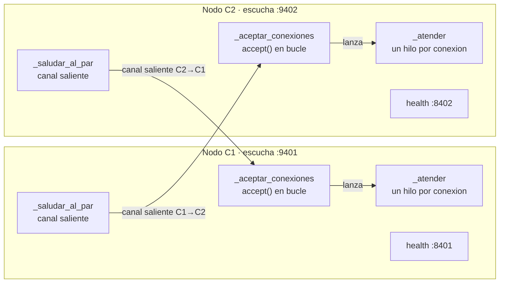

# Hit #4 — Nodo C: cliente y servidor simultáneos

> Refactoriza el código de los programas A y B en un único programa, que funcione
> simultáneamente como cliente y servidor. [...] al tener dos instancias de C en
> ejecución, cada una configurada con los parámetros del otro, ambas se saludan
> mutuamente a través de cada canal de comunicación.

## Arquitectura

Cada C combina el servidor persistente del Hit #3 y el cliente con reconexión del
Hit #2 en un mismo proceso. **Entre dos nodos hay dos conexiones TCP independientes,
una por sentido.**



| Hilo | Origen | Responsabilidad |
|---|---|---|
| `_aceptar_conexiones` | Hit #3 | Acepta conexiones y lanza un hilo por cliente |
| `_atender` | Hit #3 | Responde saludos; aísla los fallos de cada par |
| `_saludar_al_par` | Hit #2 | Abre el canal saliente, saluda y reconecta con backoff |
| health | Hit #3 | Sirve `GET /health` con el estado de **ambos** lados |

## Ejecución

Dos instancias apuntando una a la otra; el orden de arranque no importa.

```bash
python -m hit4.nodo_c --puerto 9401 --par-host 127.0.0.1 --par-puerto 9402 \
                      --nombre C1 --puerto-health 8401
python -m hit4.nodo_c --puerto 9402 --par-host 127.0.0.1 --par-puerto 9401 \
                      --nombre C2 --puerto-health 8402
```

```
INFO [hit4.nodo_c] C1 escuchando en 127.0.0.1:9401
INFO [hit4.nodo_c] [entrante] saludo de 127.0.0.1:47976: Hola, soy C2
INFO [hit4.nodo_c] [saliente] respuesta del par: Hola, soy C2. Recibi tu saludo: Hola, soy C1
```

```bash
curl http://127.0.0.1:8401/health
```

```json
{
  "servicio": "hit4-nodo-c", "nombre": "C1", "estado": "ok",
  "escuchando_en": "127.0.0.1:9401", "par": "127.0.0.1:9402",
  "canal_saliente": "conectado", "saludos_recibidos": 1,
  "saludos_enviados": 1, "respuestas_recibidas": 1, "mensajes_ilegibles": 0
}
```

`canal_saliente`: `conectado` · `reintentando` (falla conocida, con backoff en curso)
· `degradado` (falló algo no previsto; se sigue reintentando, pero queda marcado) ·
`sin_par`.

Parámetros: `--host`, `--puerto`, `--par-host`, `--par-puerto` (obligatorios los dos
últimos), `--nombre`, `--puerto-health`, `--sin-health`, `--duracion`. Por entorno:
`TP1_HOST`, `TP1_PUERTO_HIT4`, `TP1_PUERTO_HEALTH`, `TP1_TIMEOUT_INACTIVIDAD` — ver
[`.env.example`](../.env.example). Como el `--puerto-health` por defecto es el mismo
para las dos instancias, hay que darle uno propio a cada una (o `--sin-health`).

## Decisiones de diseño

- **Un canal por sentido, no uno compartido.** Cada nodo abre su propia conexión saliente en lugar de reutilizar la entrante del par: los dos sentidos quedan simétricos e independientes y la reconexión de cada uno no depende de que el otro lo haya contactado. Es también lo que necesita el Hit #6, donde un nodo saluda a varios pares que nunca lo contactan.
- **Composición en vez de reescritura:** reutiliza tal cual el `accept()` con un hilo por cliente (Hit #3) y el ciclo conectar-saludar-reintentar (Hit #2). El aporte del hit es hacerlos convivir.
- **El orden de arranque es indiferente.** El canal saliente hereda el backoff del Hit #2: la primera instancia reintenta hasta que exista la segunda. Sin esto habría que coreografiar el arranque, justo lo que un sistema distribuido no puede asumir.
- **`configurar_par()` separado del constructor.** El constructor hace el `bind`, así con `--puerto 0` el nodo descubre su puerto efímero *antes* de que haya que decirle a quién saludar. Es lo que permite armar el par en las pruebas sin fijar puertos.
- **El bucle del canal saliente no puede morir.** Además de los errores de protocolo y de socket, un `except Exception` de último recurso lo marca `degradado` y sigue reintentando. Sin él, una excepción no prevista (por ejemplo bytes ilegibles del par, que llegan como `ValueError`) mataba el hilo para siempre mientras el `/health` seguía informando `conectado`: un nodo medio muerto que ningún balanceador sacaría de rotación.
- **Espera de reintento interrumpible.** El backoff usa el evento de parada en vez de `sleep`, así `detener()` no queda bloqueado hasta 5 s.
- **`detener()` cierra los canales abiertos, no sólo el socket de escucha.** Hace `shutdown()` sobre cada conexión viva para desbloquear a los hilos parados en un `recv`.
- **La lista de hilos se poda.** Guardaba un `Thread` por conexión atendida y no descartaba nunca los terminados: una fuga de memoria silenciosa en un proceso pensado para quedarse corriendo.
- **Etiquetas `[entrante]` / `[saliente]` en el log.** Con dos canales activos, sin distinguirlos no se sabe si un saludo lo mandó este nodo o lo recibió.
- **El `/health` cubre los dos lados:** `canal_saliente` más los contadores de cada sentido permiten diagnosticar un nodo que atiende bien pero no logra saludar.

## Pruebas

```bash
python -m unittest discover -s hit4 -t . -v
```

Saludo mutuo · canales independientes · par inexistente (queda `reintentando` y pasa
a `conectado` al aparecer, sin reiniciarse) · caída del par · **el canal saliente se
recupera si el par manda basura** · **la lista de hilos no crece con las conexiones** ·
el health refleja ambos sentidos.
