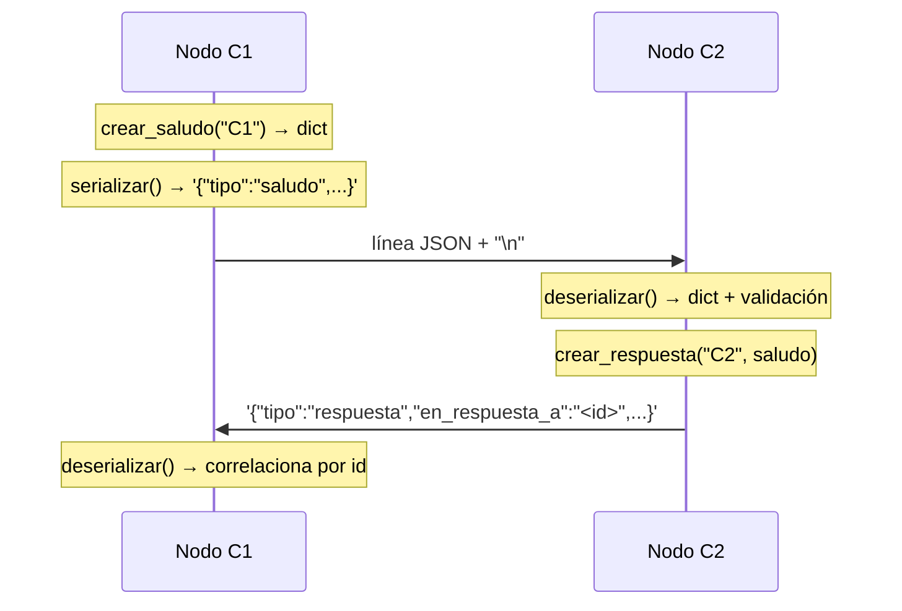

# Hit #5 — Mensajes en formato JSON

> Modifiquen el programa C para que los mensajes se envíen en formato JSON,
> serializando y deserializando al enviar/recibir.

## Arquitectura

Mismo nodo bidireccional del Hit #4; lo que cambia es **qué** viaja por los canales.
El texto plano pasa a ser un objeto JSON con estructura explícita.



La serialización vive en [`comun/mensajes.py`](../comun/mensajes.py), separada del
transporte (`comun/protocolo.py`), que sigue ocupándose sólo de delimitar.

### Formato

```json
{"version":1,"id":"95ae61fd-…","tipo":"saludo","origen":"C-externo",
 "contenido":"Hola, soy C-externo","timestamp":"2026-08-23T22:49:17.558685+00:00"}

{"version":1,"id":"674d113f-…","tipo":"respuesta","origen":"C1",
 "contenido":"Hola C-externo, soy C1. Recibi tu saludo.",
 "en_respuesta_a":"95ae61fd-…","timestamp":"2026-08-23T22:49:17.559027+00:00"}
```

| Campo | Para qué |
|---|---|
| `version` | Permite evolucionar el protocolo sin romper nodos viejos |
| `id` | Identificador único del mensaje (UUID4) |
| `tipo` | `saludo` o `respuesta`; el receptor no tiene que adivinar |
| `origen` | Quién lo envía, sin recortar cadenas de texto |
| `contenido` | El saludo legible |
| `en_respuesta_a` | Correlaciona la respuesta con su saludo |
| `timestamp` | Instante de creación en UTC (ISO 8601) |

## Ejecución

```bash
# Terminal 1
python -m hit5.nodo_c --puerto 9501 --par-host 127.0.0.1 --par-puerto 9502 \
                      --nombre C1 --puerto-health 8501

# Terminal 2
python -m hit5.nodo_c --puerto 9502 --par-host 127.0.0.1 --par-puerto 9501 \
                      --nombre C2 --sin-health
```

```
INFO [hit5.nodo_c] [entrante] saludo de C2: Hola, soy C2
INFO [hit5.nodo_c] [saliente] saludo enviado (id=6a695fb7-…, 161 bytes): Hola, soy C1
INFO [hit5.nodo_c] [saliente] respuesta de C2: Hola C1, soy C2. Recibi tu saludo.
```

Para ver el JSON crudo que viaja por el socket:

```bash
python -c "
import socket
from comun import mensajes
from comun.protocolo import LectorDeMensajes, enviar_mensaje
s = socket.create_connection(('127.0.0.1', 9501), timeout=5)
enviar_mensaje(s, mensajes.serializar(mensajes.crear_saludo('C-externo')))
print(LectorDeMensajes(s).leer_mensaje())
"
```

Mismos parámetros que el Hit #4 (`TP1_PUERTO_HIT5` por entorno).

## Decisiones de diseño

- **JSON Lines: un objeto por línea.** Se conserva el delimitador `\n` del Hit #1 en
  vez de inventar un framing nuevo. Es seguro porque `json.dumps` escapa los saltos
  de línea del contenido como `\\n` y nunca emite uno literal — hay un test que lo
  fija. La alternativa (prefijo de longitud) sería más eficiente pero ilegible al
  depurar con `tcpdump` o `nc`.
- **Serialización separada del transporte.** `comun/mensajes.py` no conoce sockets y
  `comun/protocolo.py` no conoce JSON. Por eso las pruebas del formato son unitarias
  y puras, y el Hit #8 podrá reemplazar la serialización por Protobuf sin tocar el
  framing.
- **Validar al deserializar, no confiar.** `deserializar()` verifica que sea JSON
  válido, que sea un objeto y que tenga `tipo`, `origen` y `contenido`. Un mensaje
  mal formado lanza `MensajeInvalido`, se cuenta en el `/health` y **se descarta sin
  cortar el canal**: en un sistema distribuido el emisor puede ser un nodo viejo o
  defectuoso, y eso no debe voltear al receptor.
- **`ensure_ascii=False` + UTF-8.** Mantiene los acentos legibles en el cable en vez
  de inflarlos a `\uXXXX`, que además ocuparía el triple de bytes.
- **`separators=(",", ":")`.** Sin espacios superfluos: son bytes que se pagan en
  cada mensaje y no aportan nada.
- **`id` y `en_respuesta_a`.** Correlacionar respuestas con solicitudes es lo que
  vuelve posible tener varias en vuelo por el mismo canal, en lugar de asumir que la
  siguiente respuesta corresponde al último saludo enviado.
- **`version` desde el inicio.** Agregarlo después obliga a soportar mensajes sin él.
- **La ganancia concreta sobre el Hit #4.** Antes la respuesta se armaba pegando
  texto (`"Recibi tu saludo: " + saludo`); ahora se lee `saludo["origen"]` y se
  responde *"Hola C1, soy C2"*. El receptor entiende **campos**, no una cadena que
  habría que parsear.
- **`tamano_en_bytes()`.** Deja medido el costo del formato para la comparación
  JSON vs Protobuf que pide el Hit #8 (este saludo: 161 bytes).

## Pruebas

En `tests/`, ejecutables desde la raíz del repositorio:

```bash
python -m unittest discover -s hit5 -t . -v
```

- **Unitarias del formato:** campos obligatorios, unicidad de `id`, correlación por
  `en_respuesta_a`, ida y vuelta sin pérdida, una sola línea aun con saltos en el
  contenido, acentos sin escapar, y rechazo de JSON mal formado / que no es objeto /
  sin campos obligatorios.
- **Integración:** dos nodos se saludan en JSON; se inspecciona el **JSON crudo del
  socket**, no sólo el resultado; un mensaje inválido no tumba el nodo y el canal
  sigue sirviendo; dos mensajes pegados en un mismo segmento TCP se separan bien.
