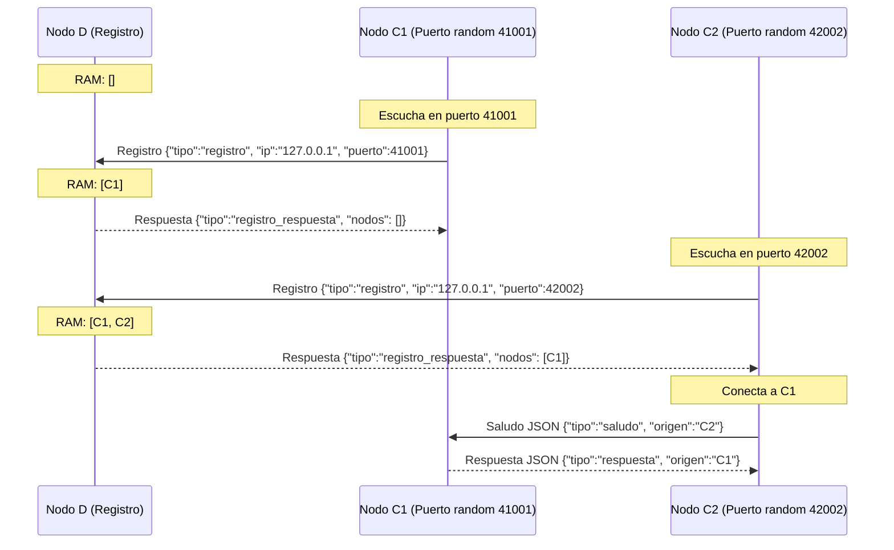

# Hit #6 — Nodo D como Registro de Contactos y Descubrimiento Dinámico

> Cree un programa D, el cual actuará como un “Registro de contactos”. Para ello, en un array en RAM, inicialmente vacío, este nodo D llevará un registro de los programas C que estén en ejecución.
>
> Además, el nodo D debe exponer un endpoint HTTP `/health` que devuelva el estado del servicio en formato JSON (cantidad de nodos C registrados, uptime, estado general). Este endpoint será utilizado como health check público del sistema.
>
> Modifique el programa C de manera tal que reciba por parámetros únicamente la IP y el puerto del programa D. C debe iniciar la escucha en un puerto aleatorio y debe comunicarse con D para informarle su IP y su puerto aleatorio donde está escuchando. D le debe responder con las IPs y puertos de los otros nodos C que estén corriendo, haga que C se conecte a cada uno de ellos y envíe el saludo.

## Arquitectura

En este hit se introduce el **Nodo D**, el cual actúa como directorio/registro centralizado de contactos. Los nodos C ya no necesitan conocer de antemano las direcciones de sus pares.



## Formato del Health Check (`/health` en Nodo D)

```json
{
  "servicio": "hit6-nodo-d",
  "nombre": "NodoD",
  "estado": "ok",
  "estado_general": "ok",
  "uptime_segundos": 12.345,
  "escuchando_en": "127.0.0.1:9600",
  "cantidad_nodos_c_registrados": 2,
  "nodos_c_registrados": 2,
  "nodos": [
    {"ip": "127.0.0.1", "puerto": 41001, "nombre": "C1"},
    {"ip": "127.0.0.1", "puerto": 42002, "nombre": "C2"}
  ]
}
```

## Ejecución

### 1. Iniciar el Nodo D (Registro de contactos)

```bash
python -m hit6.nodo_d --puerto 9600 --puerto-health 8086
```

### 2. Iniciar múltiples instancias del Nodo C (en distintas terminales)

Cada nodo C sólo recibe la IP y puerto del Nodo D (`--d-host` y `--d-puerto`). Escucha en un puerto aleatorio de forma automática y saluda a los pares existentes devueltos por D.

```bash
# Terminal 1 - Nodo C1
python -m hit6.nodo_c --d-host 127.0.0.1 --d-puerto 9600 --nombre C1 --puerto-health 8081

# Terminal 2 - Nodo C2
python -m hit6.nodo_c --d-host 127.0.0.1 --d-puerto 9600 --nombre C2 --puerto-health 8082

# Terminal 3 - Nodo C3
python -m hit6.nodo_c --d-host 127.0.0.1 --d-puerto 9600 --nombre C3 --puerto-health 8083
```

### 3. Verificar el estado público con `curl`

```bash
curl http://127.0.0.1:8086/health
```

## Decisiones de Diseño

- **Arreglo en RAMthread-safe:** El registro de contactos del Nodo D reside en un arreglo en memoria (`self._nodos_registrados`), inicializado vacío `[]` y protegido por un `threading.Lock()`.
- **Puerto aleatorio dinámico:** El Nodo C realiza `bind((host, 0))`. El valor `0` indica al sistema operativo que asigne dinámicamente un puerto efímero libre. Con `getsockname()` el nodo obtiene su puerto real asignado.
- **Protocolo desacoplado en JSON:** Se reutiliza `comun.mensajes` agregando los mensajes `registro` y `registro_respuesta`.
- **Health Check público:** Cumple estrictamente con la consigna retornando `cantidad_nodos_c_registrados`, `uptime_segundos`, `estado_general` y la lista de nodos.

## Pruebas

Ejecución de la suite completa de pruebas del Hit #6:

```bash
python -m unittest discover -s hit6 -t . -v
```
