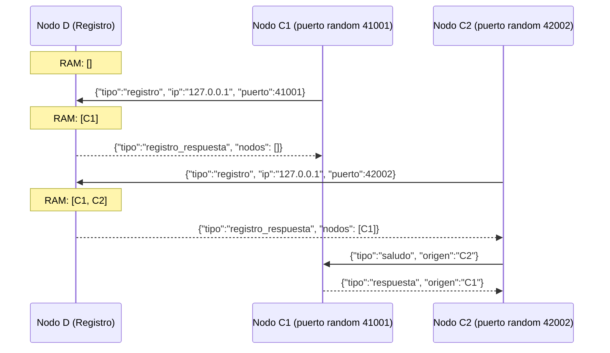

# Hit #6 — Nodo D como registro de contactos

> Cree un programa D que actuará como un "Registro de contactos": en un array en RAM,
> inicialmente vacío, lleva registro de los programas C en ejecución, y expone un
> endpoint HTTP `/health` con el estado en JSON (cantidad de nodos C registrados,
> uptime, estado general).
>
> Modifique C para que reciba por parámetros **únicamente** la IP y el puerto de D.
> C inicia la escucha en un puerto aleatorio y le informa a D su IP y ese puerto. D le
> responde con las IPs y puertos de los otros C que estén corriendo, y C se conecta a
> cada uno y envía el saludo.

## Arquitectura

D es el directorio centralizado: los C ya no conocen de antemano a sus pares.



## Ejecución

Primero D; después tantos C como se quiera, cada uno con su propio `--puerto-health`
(el default es compartido).

```bash
python -m hit6.nodo_d --puerto 9600 --puerto-health 8086

python -m hit6.nodo_c --d-host 127.0.0.1 --d-puerto 9600 --nombre C1 --puerto-health 8081
python -m hit6.nodo_c --d-host 127.0.0.1 --d-puerto 9600 --nombre C2 --puerto-health 8082
python -m hit6.nodo_c --d-host 127.0.0.1 --d-puerto 9600 --nombre C3 --puerto-health 8083

curl http://127.0.0.1:8086/health
```

```json
{
  "servicio": "hit6-nodo-d", "nombre": "NodoD", "estado": "ok",
  "estado_general": "ok", "uptime_segundos": 12.345,
  "escuchando_en": "127.0.0.1:9600",
  "cantidad_nodos_c_registrados": 2, "nodos_c_registrados": 2,
  "nodos": [
    {"ip": "127.0.0.1", "puerto": 41001, "nombre": "C1"},
    {"ip": "127.0.0.1", "puerto": 42002, "nombre": "C2"}
  ]
}
```

Por entorno o `.env`: `TP1_HOST`, `TP1_PUERTO_HIT6`, `TP1_D_HOST`, `TP1_D_PUERTO`,
`TP1_PUERTO_HEALTH_D`, `TP1_PUERTO_HEALTH`, `TP1_TIMEOUT_INACTIVIDAD` — ver
[`.env.example`](../.env.example).

## Decisiones de diseño

- **Arreglo en RAM protegido por `Lock`.** El registro (`_nodos_registrados`) arranca vacío y lo tocan varios hilos de atención a la vez.
- **Puerto aleatorio.** C hace `bind((host, 0))`: el `0` le pide al SO un puerto efímero libre, y `getsockname()` devuelve el asignado. Es lo que permite N instancias en la misma máquina sin coordinar puertos.
- **Protocolo desacoplado en JSON.** Reutiliza `comun.mensajes` agregando `registro` y `registro_respuesta`, sin tocar el framing del Hit #1.
- **D responde con los *otros* nodos.** Se excluye al que se registra, así C no se saluda a sí mismo.
- **Un mensaje por conexión.** El registro es una operación puntual, no una sesión: D lee, responde y cierra.
- **El `/health` escucha en la misma interfaz que el servicio** (`--host`), y si su puerto está ocupado el nodo arranca igual y lo registra: la observabilidad no debe tumbar al servicio observado.
- **Ningún hilo puede morir en silencio.** Los errores de protocolo (incluidos los bytes ilegibles), los timeouts de inactividad y cualquier excepción no prevista se atrapan y se loguean; sin eso el traceback iría a `stderr` sin pasar por el logger, quedando fuera de `logs/`.

## Pruebas

```bash
python -m unittest discover -s hit6 -t . -v
```
