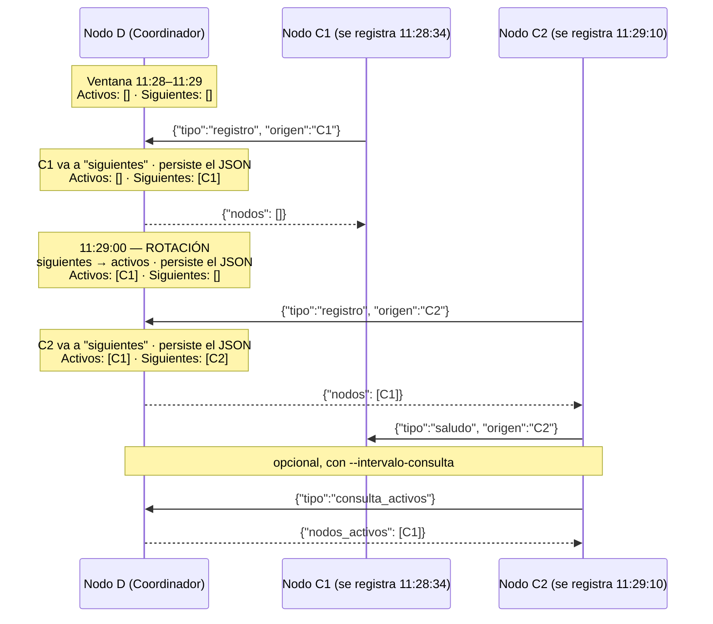

# Hit #7 — Sistema de inscripciones por ventanas de 1 min

> Implemente un "sistema de inscripciones": una ventana de tiempo fija de 1 MIN
> coordinada por D. Quien se registra a las 11:28:34 queda efectivo para la ventana de
> las 11:29; a las 11:29:00 D cierra las inscripciones y todo C que se registre queda
> anotado para las 11:30. Los C sólo pueden ver las inscripciones de la ventana
> **actual**: no saben a priori quiénes serán sus pares en la próxima.
>
> D lleva dos registros —los C activos en la ventana actual y los registrados para la
> siguiente— y cada 60 s mueve uno al otro. Las inscripciones se almacenan en un
> archivo de texto con formato JSON.

## Arquitectura



D responde siempre con la ventana **actual**: al registro con el campo `nodos` y a
la consulta con `nodos_activos`. Los `siguientes` no salen nunca por el cable.

## Ejecución

```bash
python -m hit7.nodo_d --puerto 9700 --puerto-health 8087

python -m hit7.nodo_c --d-host 127.0.0.1 --d-puerto 9700 --nombre C1 --puerto-health 8081
python -m hit7.nodo_c --d-host 127.0.0.1 --d-puerto 9700 --nombre C2 --puerto-health 8082

curl http://127.0.0.1:8087/health
cat logs/inscripciones_hit7.json
```

D acepta `--duracion-ventana` (segundos, default 60) y `--archivo-inscripciones`.
Por entorno: `TP1_PUERTO_HIT7`, `TP1_DURACION_VENTANA`, `TP1_PUERTO_HEALTH_D_HIT7`,
`TP1_PUERTO_HEALTH`, `TP1_TIMEOUT_INACTIVIDAD` — ver [`.env.example`](../.env.example).

### Persistencia (`logs/inscripciones_hit7.json`)

```json
{
  "servicio": "hit7-nodo-d",
  "actualizado_en": "2026-08-31T15:51:00+00:00",
  "ventana_actual": "2026-08-31T15:51:00+00:00",
  "duracion_ventana_segundos": 60.0,
  "cantidad_nodos_activos": 1,
  "nodos_activos": [{"ip": "127.0.0.1", "puerto": 41234, "nombre": "C1"}],
  "cantidad_nodos_siguientes": 1,
  "nodos_siguientes": [{"ip": "127.0.0.1", "puerto": 45678, "nombre": "C2"}],
  "historial_ventanas": []
}
```

El `/health` devuelve lo mismo más `escuchando_en`, `uptime_segundos`,
`estado_general` y `archivo_inscripciones`.

## Decisiones de diseño

- **Dos listas en RAM:** `_nodos_activos` (ventana en curso) y `_nodos_siguientes` (próxima ronda). Es la traducción directa del enunciado y hace trivial garantizar que un C nunca vea la ventana futura.
- **Rotación en un hilo daemon.** Cada `--duracion-ventana` segundos las futuras pasan a activas y se abre un libro nuevo. Espera sobre el evento de parada, no `sleep`, para que `detener()` no quede bloqueado hasta 60 s.
- **Persistencia atómica.** Se escribe un `.tmp` y se reemplaza el destino: si el proceso muere en medio de una rotación, el archivo nunca queda a medias.
- **Visibilidad acotada.** Al registrar o consultar, D devuelve **sólo** los nodos de la ventana activa. Es el requisito central del hit y por eso está en la respuesta misma, no filtrado del lado de C.
- **El `/health` escucha en la misma interfaz que el servicio** (`--host`), y si su puerto está ocupado el nodo arranca igual y lo registra.
- **Ningún hilo puede morir en silencio.** Errores de protocolo (bytes ilegibles incluidos), timeouts de inactividad y excepciones no previstas se atrapan y se loguean, en vez de terminar como un traceback en `stderr` fuera de `logs/`.

## Pruebas

```bash
python -m unittest discover -s hit7 -t . -v
```
