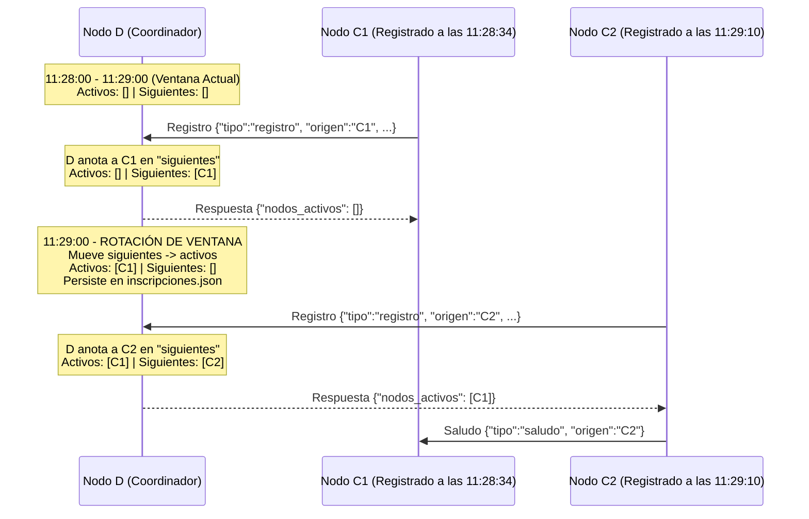

# Hit #7 — Sistema de Inscripciones por Ventanas de Tiempo (1 min)

> Modifique el programa C y D, de manera tal de implementar un “sistema de inscripciones”, esto es, se define una ventana de tiempo fija de 1 MIN, coordinada por D, y los nodos C deben registrarse para participar de esa ventana. Cuando un nodo C se registra a las 11:28:34 en D, el registro se hace efectivo para la próxima ventana de tiempo que corresponde a las 11:29. Cuando se alcanza las 11:29:00, el nodo D cierra las inscripciones y todo nodo C que se registre será anotado para la ventana de las 11:30. Los nodos C que consulten las inscripciones activas solo pueden ver las inscripciones de la ventana actual, es decir, los nodos C no saben a priori cuáles son sus pares para la próxima ventana de tiempo, solo saben los que están activos actualmente. Recuerde almacenar las inscripciones en un archivo de texto con formato JSON. Esto facilitará el seguimiento ordenado de las ejecuciones y asegurará la verificación de los resultados esperados.
>
> Para simplificar el problema, imagine que D lleva dos registros: un listado de los nodos C activos en la ventana actual, y un registro de nodos C registrados para la siguiente ventana. Cada 60 segundos el nodo D mueve los registros de las inscripciones futuras a la presente y comienza a inscribir para la siguiente ronda.

## Arquitectura



## Persistencia JSON (`inscripciones.json`)

El Nodo D guarda el estado de las inscripciones en `logs/inscripciones_hit7.json`:

```json
{
  "servicio": "hit7-nodo-d",
  "actualizado_en": "2026-08-31T15:51:00+00:00",
  "ventana_actual": "2026-08-31T15:51:00+00:00",
  "duracion_ventana_segundos": 60.0,
  "cantidad_nodos_activos": 1,
  "nodos_activos": [
    {"ip": "127.0.0.1", "puerto": 41234, "nombre": "C1"}
  ],
  "cantidad_nodos_siguientes": 1,
  "nodos_siguientes": [
    {"ip": "127.0.0.1", "puerto": 45678, "nombre": "C2"}
  ],
  "historial_ventanas": []
}
```

## Formato del Health Check (`/health` en Nodo D)

```json
{
  "servicio": "hit7-nodo-d",
  "nombre": "NodoD-Hit7",
  "estado": "ok",
  "estado_general": "ok",
  "uptime_segundos": 15.2,
  "escuchando_en": "127.0.0.1:9700",
  "ventana_actual": "2026-08-31T15:51:00+00:00",
  "duracion_ventana_segundos": 60.0,
  "cantidad_nodos_activos": 1,
  "nodos_activos": [...],
  "cantidad_nodos_siguientes": 1,
  "nodos_siguientes": [...],
  "archivo_inscripciones": ".../logs/inscripciones_hit7.json"
}
```

## Ejecución

### 1. Iniciar Nodo D (Coordinador con ventana por defecto de 60s)

```bash
python -m hit7.nodo_d --puerto 9700 --puerto-health 8087
```

### 2. Iniciar Nodos C

```bash
# Terminal 2 - Nodo C1
python -m hit7.nodo_c --d-host 127.0.0.1 --d-puerto 9700 --nombre C1 --puerto-health 8081

# Terminal 3 - Nodo C2
python -m hit7.nodo_c --d-host 127.0.0.1 --d-puerto 9700 --nombre C2 --puerto-health 8082
```

### 3. Consultar Health Check y Archivo JSON

```bash
curl http://127.0.0.1:8087/health
cat logs/inscripciones_hit7.json
```

## Decisiones de Diseño

- **Dos registros en RAM:** `self._nodos_activos` para la ventana en curso y `self._nodos_siguientes` para la próxima ronda.
- **Rotación periódica en hilo daemon:** Cada 60 segundos (o parámetro `--duracion-ventana`), los nodos futuros pasan a activos y se abre un nuevo libro de inscripciones.
- **Persistencia atómica en JSON:** Se utiliza un archivo `.tmp` antes de reemplazar el destino para evitar lecturas parciales o corrupción si el proceso se detiene en medio de una rotación.
- **Visibilidad acotada:** Al responder a una consulta/registro, D retorna **únicamente** los nodos de la ventana activa, garantizando que C solo descubra a los pares en ejecución presente.

## Pruebas

Ejecutar las pruebas del Hit #7:

```bash
python -m unittest discover -s hit7 -t . -v
```
