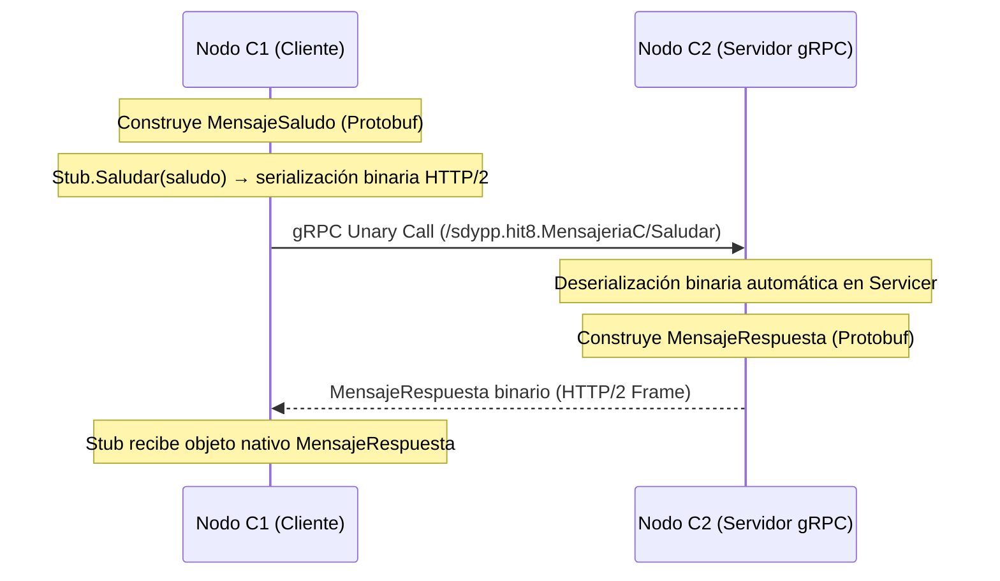

# Hit #8 — gRPC / Protocol Buffers

> Refactoricen la comunicación del Hit #5 (mensajes JSON sobre TCP) reemplazándola por gRPC con Protocol Buffers — la materialización moderna del concepto clásico de RPC (Birrell & Nelson 1984, Srinivasan 1995). Para ello:
> - Definan un archivo `.proto` que describa los mensajes y servicios de comunicación entre los nodos C y D.
> - Generen los stubs de cliente y servidor con el compilador `protoc`.
> - Reemplacen la serialización/deserialización JSON manual por las llamadas gRPC generadas.
> - Comparen en el informe: tamaño de los mensajes en bytes (JSON vs Protobuf), latencia de las llamadas y experiencia de desarrollo (código manual vs código generado).

## Arquitectura

Se reemplaza el canal de sockets TCP raw con delimitador `\n` y serialización JSON manual por el framework **gRPC** sobre **HTTP/2**, utilizando **Protocol Buffers (proto3)** para la definición estricta del contrato de interfaz (IDL) y la serialización binaria de mensajes.



El contrato de la interfaz reside en [`hit8/proto/servicio.proto`](proto/servicio.proto), y el código generado (`servicio_pb2.py` y `servicio_pb2_grpc.py`) provee los tipos de datos y stubs cliente/servidor.

### Formato y Definición del Servicio (`hit8/proto/servicio.proto`)

```protobuf
syntax = "proto3";

package sdypp.hit8;

service MensajeriaC {
    rpc Saludar (MensajeSaludo) returns (MensajeRespuesta);
}

service RegistroD {
    rpc Registrar (RegistroSolicitud) returns (RegistroRespuesta);
    rpc ConsultarActivos (ConsultaActivosSolicitud) returns (ConsultaActivosRespuesta);
}

message MensajeSaludo {
    int32 version = 1;
    string id = 2;
    string tipo = 3;
    string origen = 4;
    string contenido = 5;
    string timestamp = 6;
}

message MensajeRespuesta {
    int32 version = 1;
    string id = 2;
    string tipo = 3;
    string origen = 4;
    string contenido = 5;
    string en_respuesta_a = 6;
    string timestamp = 7;
}

message InfoNodo {
    string ip = 1;
    int32 puerto = 2;
    string nombre = 3;
}

message RegistroSolicitud {
    int32 version = 1;
    string id = 2;
    string tipo = 3;
    string origen = 4;
    string contenido = 5;
    string ip = 6;
    int32 puerto = 7;
    string timestamp = 8;
}

message RegistroRespuesta {
    int32 version = 1;
    string id = 2;
    string tipo = 3;
    string origen = 4;
    string contenido = 5;
    string en_respuesta_a = 6;
    repeated InfoNodo nodos = 7;
    string timestamp = 8;
}
```

| Campo | Para qué |
|---|---|
| `version` | Evolución y compatibilidad de esquema hacia adelante y atrás |
| `id` | Identificador único del mensaje (UUID4) |
| `tipo` | Tipado del mensaje (`saludo`, `respuesta`, `registro`, etc.) |
| `origen` | Identificador del nodo emisor |
| `contenido` | Carga útil o mensaje legible |
| `en_respuesta_a` | Correlación entre la respuesta y la solicitud RPC previa |
| `timestamp` | Instante de creación en UTC (ISO 8601) |

## Ejecución

### 1. Generación de Stubs (Compilación `.proto`)

```bash
python -m grpc_tools.protoc -I. --python_out=. --grpc_python_out=. hit8/proto/servicio.proto
```

### 2. Ejecución de Nodos

**Modo Par a Par (Hit #5 refactorizado a gRPC):**
```bash
python -m hit8.nodo_c --puerto 9501 --par-host 127.0.0.1 --par-puerto 9502 \
                      --nombre C1 --puerto-health 8501
python -m hit8.nodo_c --puerto 9502 --par-host 127.0.0.1 --par-puerto 9501 \
                      --nombre C2 --sin-health
```

```
INFO [hit8.nodo_c] C1 servidor gRPC escuchando en 127.0.0.1:9501
INFO [hit8.nodo_c] [saliente] saludo gRPC enviado a 127.0.0.1:9502 (id=6a695fb7-…, 100 bytes): Hola, soy C1
INFO [hit8.nodo_c] [entrante] saludo de C2 (id=9b183c21-…): Hola, soy C2
INFO [hit8.nodo_c] [saliente] respuesta de C2 (id=e741c8fa-…, en_respuesta_a=6a695fb7-…, 163 bytes): Hola C1, soy C2. Recibi tu saludo.
```

**Modo con Registro Dinámico D (Hit #6/Hit #7 con gRPC):**
```bash
python -m hit8.nodo_d --puerto 9608 --puerto-health 8086
python -m hit8.nodo_c --d-host 127.0.0.1 --d-puerto 9608 --nombre C1 --puerto-health 8081
python -m hit8.nodo_c --d-host 127.0.0.1 --d-puerto 9608 --nombre C2 --puerto-health 8082
```

Para consultar el estado vía `/health`:
```bash
curl http://127.0.0.1:8501/health
```

```json
{
  "servicio": "hit8-nodo-c",
  "formato_mensajes": "protobuf-grpc",
  "nombre": "C1",
  "estado": "ok",
  "uptime_segundos": 14.502,
  "escuchando_en": "127.0.0.1:9501",
  "par": "127.0.0.1:9502",
  "canal_saliente": "conectado",
  "saludos_recibidos": 5,
  "saludos_enviados": 5,
  "respuestas_recibidas": 5,
  "mensajes_invalidos": 0,
  "mensajes_ignorados": 0
}
```

---

## Comparativa: JSON sobre TCP vs gRPC con Protobuf

### 1. Tamaño de los mensajes en bytes

Comparación de la carga útil codificada para un mensaje idéntico (mismos UUIDs, origen y timestamps):

| Mensaje | JSON (UTF-8) | Protobuf (Binario) | Reducción de bytes |
|---|---|---|---|
| **Saludo** (`MensajeSaludo`) | 161 bytes | 100 bytes | **-37.9%** |
| **Respuesta** (`MensajeRespuesta`) | 242 bytes | 163 bytes | **-32.6%** |
| **Viaje Completo (RTT)** | 403 bytes | 263 bytes | **-34.7%** |

**Razón:** En JSON, las claves (`"version"`, `"id"`, `"timestamp"`, `"en_respuesta_a"`, etc.) y la sintaxis estructural (`{}`, `""`, `,`, `:`) se transmiten en texto plano en cada mensaje. En Protobuf, los nombres de los campos se reemplazan por tags numéricos compactos (Varints de 1 byte), los enteros usan codificación variable y no hay delimitadores de texto superfluos.

### 2. Latencia de las llamadas (Benchmark en loopback local)

Medición sobre 200 operaciones consecutivas cliente-servidor:

| Métrica | JSON sobre Socket TCP persistente | gRPC sobre HTTP/2 |
|---|---|---|
| **Latencia promedio** | `~0.075 ms` | `~0.360 ms` |
| **Latencia mínima** | `0.065 ms` | `0.255 ms` |
| **Framing / Transporte** | Socket directo L4 (TCP stream + `\n`) | Multiplexación HTTP/2 + Frames gRPC + ThreadPool |

*Observación:* En un entorno loopback local (IPC/localhost), el socket crudo de bajo nivel con un parser manual elemental es muy veloz debido a la ausencia casi total de capas intermedias. gRPC introduce el overhead de la máquina de estados de HTTP/2 (headers HPACK, streams lógicos y capas de contexto/interceptores en Python). No obstante, en redes reales distribuidas y con alto tráfico concurrente, la multiplexación en una sola conexión TCP de HTTP/2, el streaming bidireccional y el menor uso de ancho de banda por compresión y Protobuf ofrecen una escalabilidad y throughput netamente superiores.

### 3. Experiencia de desarrollo (DX): Código manual vs Código generado

| Aspecto | Hit #5 (JSON manual sobre TCP) | Hit #8 (gRPC / Protobuf) |
|---|---|---|
| **Definición de Contrato** | Implícita en diccionarios y documentación de código. Riesgo de desalineación entre nodos. | Explícita y estricta en `.proto` (IDL neutral e independiente del lenguaje). |
| **Validación de Tipos** | Manual (`isinstance`, comprobación de claves requeridas, manejo defensivo de `KeyError`/`JSONDecodeError`). | Fuerte y en tiempo de compilación/ejecución por los stubs generados. |
| **Transporte y Framing** | Implementación artesanal de delimitación por buffers (`\n`, prefijos de longitud, `recv` en chunks). | Transparente: el desarrollador invoca un método nativo (`stub.Saludar()`). |
| **Manejo de Errores** | Excepciones personalizadas sobre el socket, traducción manual de desconexiones. | Códigos de estado estándar de la industria (`grpc.StatusCode.INVALID_ARGUMENT`, `UNAVAILABLE`, etc.). |
| **Interoperabilidad** | Requiere parsear JSON manualmente en cada nuevo lenguaje cliente. | Generación automática de SDKs y clientes en C++, Java, Go, Rust, TypeScript, etc. con `protoc`. |

---

## Decisiones de diseño

- **Aislamiento modular completo:** El Hit #8 no modifica ni contamina `comun/mensajes.py` ni `comun/protocolo.py`, preservando la compatibilidad retroactiva e integridad de las pruebas de los Hits #1 a #7.
- **Servicios Unary RPC:** La comunicación se modela mediante invocaciones unarias `Saludar`, `Registrar` y `ConsultarActivos`, mapeando de forma natural el patrón solicitud-respuesta de los hits anteriores.
- **Soporte dual de topologías:** `hit8/nodo_c.py` soporta tanto el esquema de par fijo bidireccional (con backoff de reconexión adaptado a `RpcError`) como el registro y descubrimiento dinámico contra `hit8/nodo_d.py`.
- **Compatibilidad con Observabilidad (`/health`):** Los nodos exponen el endpoint HTTP `/health` reportando `"formato_mensajes": "protobuf-grpc"`, permitiendo monitorear métricas de saludos enviados, recibidos y errores de RPC.

## Pruebas

```bash
python -m unittest discover -s hit8 -t . -v
```

- **Unitarias Protobuf:** Validación de serialización/deserialización, comprobación de campos requeridos y medición de tamaño de carga binaria.
- **Integración gRPC:** Comunicación bidireccional entre dos nodos C · invocación con stubs generados · manejo y propagación de errores (`grpc.RpcError`) ante mensajes inválidos · registro y descubrimiento dinámico contra el nodo D.
